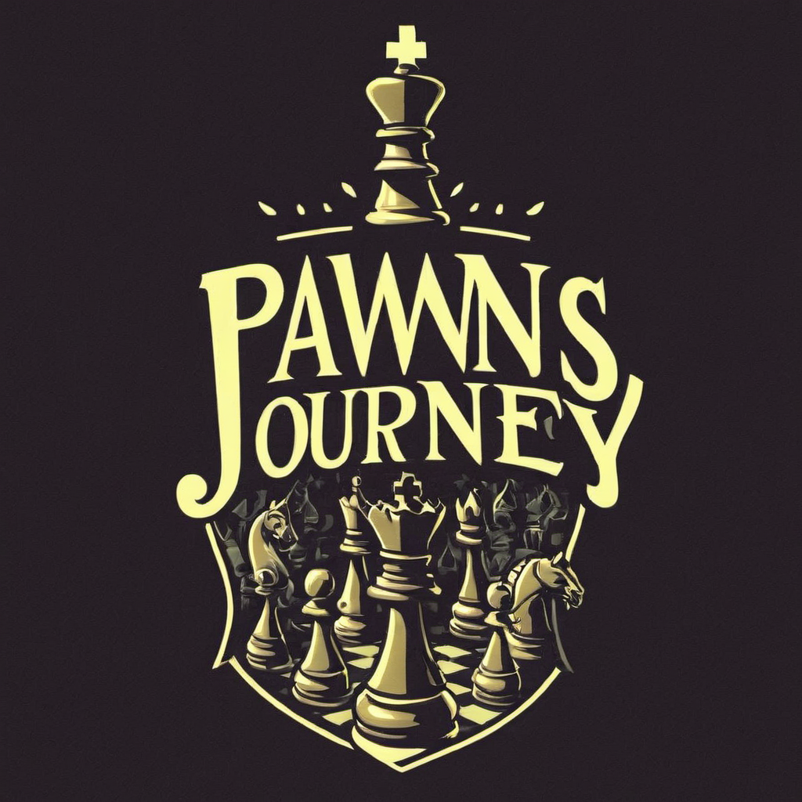

# The Pawn's Journey

<p align="center">
  
</p>

<p align="center">
  <a href="https://github.com/vuejs/vue">
    
  </a>
  <a href="https://github.com/vuetifyjs/vuetify">
    
  </a>
  <a href="https://github.com/kingyue737/vitify-admin/blob/main/LICENSE">
    
  </a>
</p>

## Overview

The Pawn's Journey is a Vue 3 application that helps chess players improve their skills through puzzles. The puzzles are categorized by difficulty level, and players can track their progress over time.

## Features

- Chess puzzles from the Lichess public database
- Puzzles categorized by difficulty level
- Progress tracking

## Getting Started
```
npx degit spothound/ThePawnsJourney ThePawnsJourney
cd ThePawnsJourney
pnpm i
pnpm dev
```
